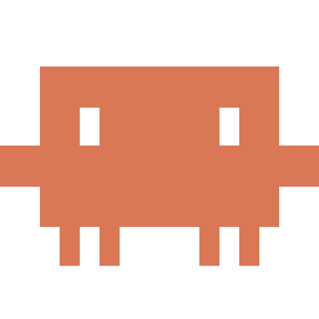
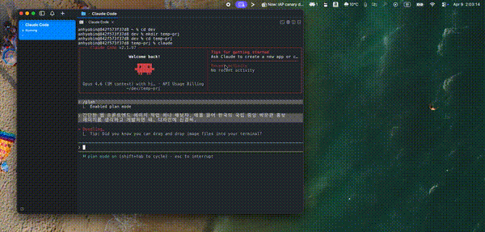

<p align="center">
  
</p>

<h1 align="center">Claude Code Monitor</h1>

<p align="center">
  A native macOS menu bar app for monitoring Claude Code CLI sessions in real time.
</p>

<p align="center">
  
  
  
  
</p>

---

## Demo

<p align="center">
  <a href="https://github.com/anhyobin/mac-app-for-claude-code/releases/download/v0.1.0/cc_monitor_demo.mp4">
    
  </a>
</p>

<p align="center"><b>▶ Click the preview to watch the full demo (2 min)</b></p>

## Why?

When you're deep in a Claude Code CLI session, the terminal is all you have. There's no easy way to see how many sessions are active, how much token budget you've burned, or what your agent team is doing — without scrolling through terminal output.

Claude Code Monitor lives in your macOS menu bar and gives you a bird's-eye view of every active session, agent, and task — updated in real time with zero setup.

## Features

- **Live Session Tracking** — Detects active sessions every 5 seconds via FSEvents, with instant file-change reactions
- **Agent Team Overview** — See all subagents (dev, qa, review, etc.) with their status, token usage, and tool call counts
- **Aggregated Token Usage** — Input, output, and cache tokens summed across the main session and all subagents
- **Task Board** — Per-session and per-agent task lists with status tracking (pending / in progress / completed)
- **Agent Details** — Drill into any agent to see recent messages, modified files, and tool usage breakdown
- **Session History** — Browse completed sessions with model name, duration, and token summary

## Quick Start

### Prerequisites

- macOS 14.0 (Sonoma) or later
- Xcode Command Line Tools (`xcode-select --install`)
- Claude Code CLI installed with at least one prior session (`~/.claude/` directory must exist)

### Build & Run

```bash
git clone https://github.com/anhyobin/mac-app-for-claude-code.git
cd mac-app-for-claude-code
bash scripts/build-app.sh
open ClaudeCodeMonitor.app
```

The build produces a self-contained `ClaudeCodeMonitor.app` bundle (~1.0 MB) in the project root. No Xcode project required — just Swift Package Manager.

### Distribution

The app is ad-hoc signed. To share it with others, zip and distribute:

```bash
zip -r ClaudeCodeMonitor.zip ClaudeCodeMonitor.app
```

> **Note**: Recipients will need to allow the app in **System Settings > Privacy & Security** on first launch.

## How It Works

```
~/.claude/sessions/          ClaudeCodeMonitor.app
┌──────────────────┐         ┌──────────────────────────┐
│  session.json    │         │                          │
│  conversation/   │ ──FSEvents──>  SessionFileReader   │
│    *.jsonl       │         │         │                │
│  subagents/      │         │    JSONLParser           │
│    meta.json     │         │    SubagentLoader        │
│    *.jsonl       │         │    TaskLoader            │
│  tasks/          │         │         │                │
│    *.json        │         │    ClaudeDataStore       │
└──────────────────┘         │    (@Observable)         │
                             │         │                │
                             │    SwiftUI MenuBarExtra  │
                             │    (popover window)      │
                             └──────────────────────────┘
```

1. **FSEvents** watches `~/.claude/sessions/` for any file-system changes
2. **SessionFileReader** discovers active sessions by reading `session.json` files and validating process IDs
3. **JSONLParser** streams conversation JSONL files to extract token counts, messages, and file changes
4. **SubagentLoader** and **TaskLoader** parse subagent metadata and task state
5. **ClaudeDataStore** (`@Observable`) aggregates everything into a single reactive data model
6. **SwiftUI MenuBarExtra** renders the popover UI, updating automatically when data changes

## Project Structure

```
Sources/ClaudeCodeMonitor/
├── App/                  # App entry point, MenuBarExtra configuration
├── Models/               # Data types: sessions, agents, tokens, tasks, conversations
├── DataLayer/            # Core logic: file reading, JSONL parsing, FSEvents watcher
├── Views/                # SwiftUI views: session list, agent details, token badges
├── Utilities/            # Formatters: token counts (1.2K), relative time (3h 42m), model names
└── Resources/            # App icon and menu bar icons
```

| Layer | Responsibility |
|-------|---------------|
| **Models** | Pure value types — no logic, no dependencies |
| **DataLayer** | Reads `~/.claude/`, parses JSON/JSONL, manages FSEvents, validates PIDs |
| **Views** | Stateless SwiftUI views bound to `ClaudeDataStore` |
| **Utilities** | Display formatting only — no side effects |

## Tech Stack

| | |
|---|---|
| **Language** | Swift 6.0 with Strict Concurrency |
| **UI** | SwiftUI `MenuBarExtra(.window)` |
| **Build** | Swift Package Manager (no Xcode project) |
| **File Watching** | FSEvents via CoreServices |
| **Dependencies** | None — pure Apple frameworks |
| **Binary Size** | ~1.0 MB |

## Contributing

Contributions are welcome. If you'd like to help:

1. Fork the repository
2. Create a feature branch (`git checkout -b feature/your-feature`)
3. Commit your changes
4. Open a pull request

Please keep PRs focused — one feature or fix per PR.

## Notes

- Opus 4.7 uses a new tokenizer — token counts may read 1.0~1.35× higher than Opus 4.6 for the same work.

## Changelog

See [CHANGELOG.md](CHANGELOG.md) for the release history.

## License

This project is licensed under the [MIT License](LICENSE).
